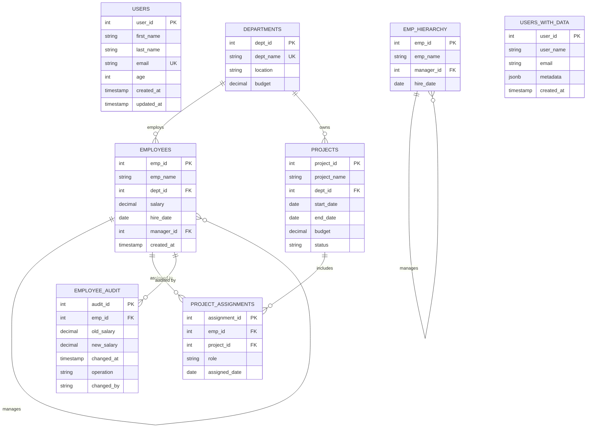
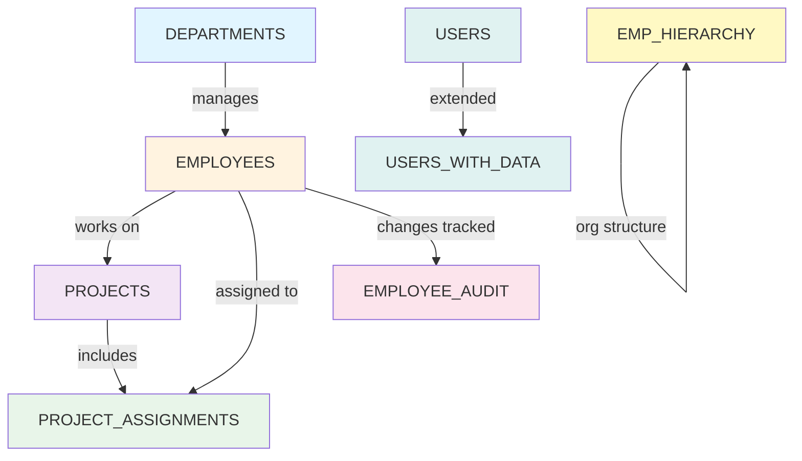

# Database Diagrams & Architecture

## Entity Relationship Diagram (ERD)

This diagram shows the complete database schema created by `01-setup.sql`:



---

## Schema Overview

### 📋 Table Summary

| Table | Purpose | Key Column | Relations |
|-------|---------|-----------|-----------|
| **USERS** | Basic user records | `user_id` (SERIAL) | Standalone |
| **DEPARTMENTS** | Organizational units | `dept_id` (SERIAL) | Parent to EMPLOYEES, PROJECTS |
| **EMPLOYEES** | Staff records | `emp_id` (SERIAL) | Links to DEPARTMENTS, self-references for managers |
| **PROJECTS** | Project tracking | `project_id` (SERIAL) | Links to DEPARTMENTS |
| **PROJECT_ASSIGNMENTS** | Employee-Project mapping | `assignment_id` (SERIAL) | Junction table (many-to-many) |
| **EMP_HIERARCHY** | Management hierarchy | `emp_id` (SERIAL) | Self-referencing (tree structure) |
| **EMPLOYEE_AUDIT** | Salary change log | `audit_id` (SERIAL) | Tracks changes to EMPLOYEES |
| **USERS_WITH_DATA** | Users with JSON metadata | `user_id` (SERIAL) | Stores flexible JSON data |

---

## Key Relationships Explained

### 1. **DEPARTMENTS → EMPLOYEES** (One-to-Many)
```
One department can have many employees
DEPARTMENTS.dept_id ←→ EMPLOYEES.dept_id
```

```sql
-- Example: All employees in Sales department
SELECT e.emp_name, d.dept_name
FROM employees e
JOIN departments d ON e.dept_id = d.dept_id
WHERE d.dept_name = 'Sales';
```

### 2. **EMPLOYEES → EMPLOYEES** (Self-Referencing - Hierarchy)
```
An employee can manage other employees
EMPLOYEES.emp_id ←→ EMPLOYEES.manager_id
```

```sql
-- Example: Show employee with their manager's name
SELECT 
    e.emp_name AS employee,
    m.emp_name AS manager
FROM employees e
LEFT JOIN employees m ON e.manager_id = m.emp_id;
```

### 3. **DEPARTMENTS → PROJECTS** (One-to-Many)
```
One department can own many projects
DEPARTMENTS.dept_id ←→ PROJECTS.dept_id
```

```sql
-- Example: Projects owned by Engineering
SELECT p.project_name, d.dept_name
FROM projects p
JOIN departments d ON p.dept_id = d.dept_id
WHERE d.dept_name = 'Engineering';
```

### 4. **EMPLOYEES ↔ PROJECTS** (Many-to-Many via PROJECT_ASSIGNMENTS)
```
Many employees can work on many projects
Resolved through junction table PROJECT_ASSIGNMENTS
```

```sql
-- Example: All employees working on specific project
SELECT e.emp_name, pa.role
FROM employees e
JOIN project_assignments pa ON e.emp_id = pa.emp_id
WHERE pa.project_id = 1;

-- Example: All projects for specific employee
SELECT p.project_name, pa.role
FROM projects p
JOIN project_assignments pa ON p.project_id = pa.project_id
WHERE pa.emp_id = 1;
```

### 5. **EMPLOYEES → EMPLOYEE_AUDIT** (One-to-Many)
```
Each employee can have multiple audit records
EMPLOYEES.emp_id ←→ EMPLOYEE_AUDIT.emp_id
```

```sql
-- Example: Salary history for an employee
SELECT old_salary, new_salary, changed_at
FROM employee_audit
WHERE emp_id = 1
ORDER BY changed_at DESC;
```

### 6. **EMP_HIERARCHY → EMP_HIERARCHY** (Self-Referencing)
```
Separate hierarchy table for organizational tree
EMP_HIERARCHY.emp_id ←→ EMP_HIERARCHY.manager_id
```

```sql
-- Example: Management chain (recursive)
WITH RECURSIVE emp_chain AS (
    SELECT emp_id, emp_name, manager_id, 1 as level
    FROM emp_hierarchy
    WHERE manager_id IS NULL
    
    UNION ALL
    
    SELECT e.emp_id, e.emp_name, e.manager_id, ec.level + 1
    FROM emp_hierarchy e
    JOIN emp_chain ec ON e.manager_id = ec.emp_id
)
SELECT REPEAT('  ', level-1) || emp_name FROM emp_chain;
```

---

## Cardinality Legend

| Symbol | Meaning |
|--------|---------|
| `\|\|` | One and only one |
| `o{` | Zero or one |
| `\|\{` | One or many |
| `o{` | Zero or many |

---

## Data Flow Diagram



---

## Query Patterns by Use Case

### Pattern 1: Get Employee Info with Department
```sql
SELECT e.emp_name, e.salary, d.dept_name, m.emp_name as manager
FROM employees e
LEFT JOIN departments d ON e.dept_id = d.dept_id
LEFT JOIN employees m ON e.manager_id = m.emp_id;
```

### Pattern 2: Find Employees on Specific Project
```sql
SELECT e.emp_name, pa.role, p.project_name
FROM employees e
JOIN project_assignments pa ON e.emp_id = pa.emp_id
JOIN projects p ON pa.project_id = p.project_id
WHERE p.project_name = 'Website Redesign';
```

### Pattern 3: Department Summary with Employee Count
```sql
SELECT 
    d.dept_name,
    COUNT(e.emp_id) as emp_count,
    AVG(e.salary) as avg_salary,
    SUM(e.salary) as total_salary
FROM departments d
LEFT JOIN employees e ON d.dept_id = e.dept_id
GROUP BY d.dept_id, d.dept_name;
```

### Pattern 4: Show Project Participation by Department
```sql
SELECT 
    d.dept_name,
    COUNT(DISTINCT p.project_id) as project_count,
    COUNT(DISTINCT pa.emp_id) as employee_count
FROM departments d
LEFT JOIN projects p ON d.dept_id = p.dept_id
LEFT JOIN project_assignments pa ON p.project_id = pa.project_id
GROUP BY d.dept_id, d.dept_name;
```

---

**Reference this diagram when practicing queries to understand table relationships!**
